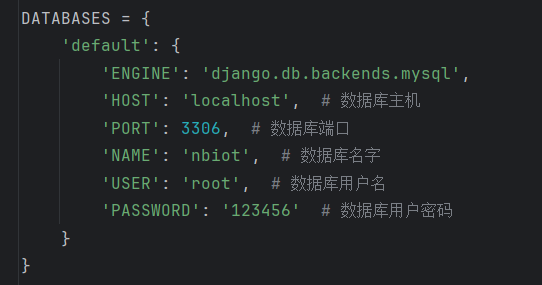
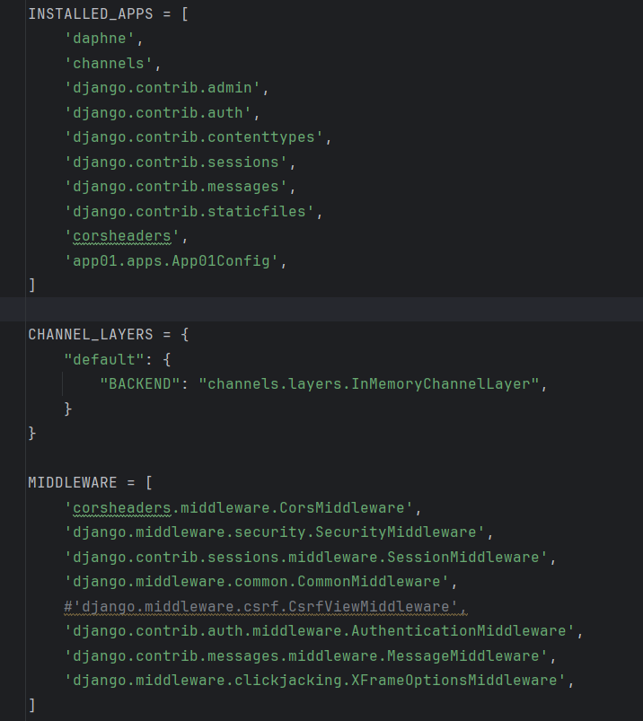

# Django测试程序1 
## 安装环境/配置
1. 安装Django `
pip install django djangorestframework
`
```bash 
#步骤，运行程序 manage.py
python manage.py runserver 127.0.0.1:8000
# **测试程序**（app01/clinet、tcp-server。）
python app01/clinet.py  
```
2. 修改数据库，mange.py 

## **功能1：** _rest_framework_
+ ### 添加注册组件 

+  ### 使用asgi路由